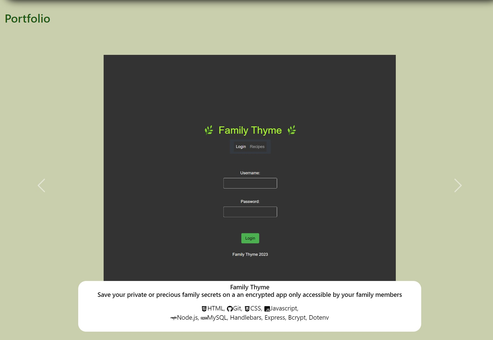
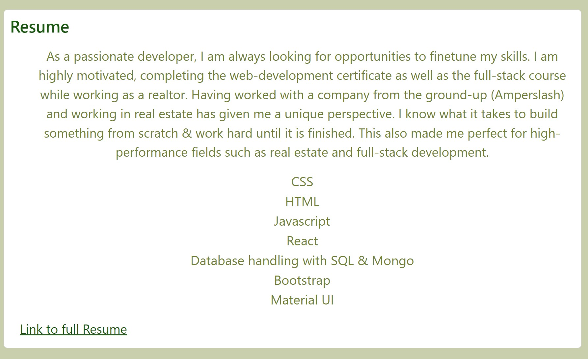

# Saraf's React Portfolio

## Table of Contents 
- [Description](#description)
- [Installation](#installation)
- [Usage](#usage)
- [License](#license)
- [Contributing](#contributing)
- [Tests](#tests)
- [Questions](#questions)

## Description:
Employers are always looking for candidates with experience in building single-page applications. As a developer it is incredibly useful to have a deployed portfolio of work samples. Use this portfolio as to view my past projects, resume and a form to contact me with. 
*Created using React and it utilizes bootstrap.*

## Installation
- Clone the repo
- Run `npm i` in terminal to install packages
- view it on local machine on port 3000

## Usage:

Screenshots:

This screenshot shows the Homepage / Navigation / About Me sections. The option becomes highlighted when cursor is hovering. 

There is an input section at the top that asks the user their name which is displayed at the top as they type. This adds to the user experience as users can see a live change and interact with the webpage. 

Once the "tell me" button is clicked, the window message reads: `"Hello -user input-, Thank you for visiting my page!"`

Clicking on the portfolio tab in the navigation will take the user to this section where portfolio projects are displayed in a carousel with a caption explaining the project & icons showing the different technologies used. 

This is the resume section with a preview and the skills. There is a link to the full resume, which is a deployed application.  

Below image shows the contact form. It also shows the footer which includes icons that link to the corresponding profiles of the author. 

## License:

## Questions:
- Github: [github.com/sophack](https://github.com/sophack)
- Email: sarafnrealtor@gmail.com 